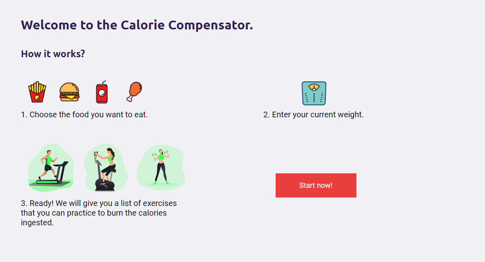

# Calorie Compensator

This is a application that receives a food, its quantity and the user's weight, then returns a list of exercises that the user can do to burn the calories of the inserted food. It uses the [FoodData Central API](https://fdc.nal.usda.gov/index.html) to get the food data, like calories, protein, carbs, fiber and fat. To get the information about the calories burned in each exercices, it uses the Metabolic Equivalent of Task (MET) values taken from: [The Compendium of Physical Trackings Guide. Prevention Research Center, University of South Carolina](http://prevention.sph.sc.edu/tools/docs/documents_compendium.pdf).

More information about the formula and the accuracy of this application can be accessed through the about page of the live demo.

## Instalation

yarn install

## Start the app

yarn start

## Live Demo

https://caloriecompensator.netlify.app/
